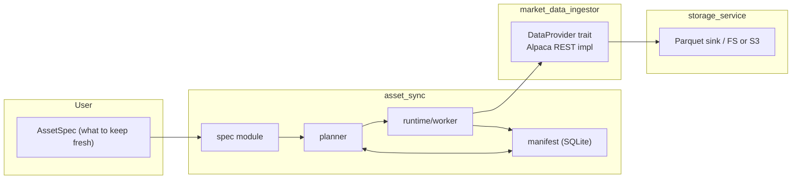

# Stock Trading Bot

[](https://www.rust-lang.org)

[](https://github.com/mag1cfrog/stock_trading_bot/actions/workflows/ci.yml)

A modular, Rust-native system for fetching market data and keeping datasets fresh for research and trading.

**Status:** Active personal project. The system is migrating to a cleaner, crate-per-concern workspace.

## Workspace at a glance

- `market_data_ingestor/` — provider-agnostic fetcher returning canonical `BarSeries` (currently: Alpaca REST).
- `asset_sync/` — keeps data fresh: declarative specs, a manifest (SQLite), a planner, and a lightweight runtime.
- `storage_service/` — I/O layer (e.g., Parquet to local/S3).
- `shared_utils/` — shared types and helpers.

### Architecture



## Why this design

- Separation of concerns: fetching vs. planning vs. storage.
- Declarative freshness: define *what you want*; the system plans backfill + ongoing refresh.
- Rust first: async I/O, strong typing, predictable performance.

## Getting started

### Prereqs
- Rust (stable toolchain).
- If using Alpaca, set env vars:
```bash
export ALPACA_API_KEY=...
export ALPACA_SECRET_KEY=...
```

### Build & test
```bash
# workspace lives under src/
cd src
cargo build --workspace
cargo test  --workspace
```

### Quick example: fetch daily bars
```rust
use market_data_ingestor::{
    providers::alpaca_rest::provider::AlpacaProvider,
    models::{
        request_params::BarsRequestParams,
        timeframe::{TimeFrame, TimeFrameUnit},
        asset::AssetClass,
    },
};
use chrono::{Utc, Duration};

# #[tokio::main]
# async fn main() -> Result<(), Box<dyn std::error::Error>> {

    let provider = AlpacaProvider::new()?;

    let params = BarsRequestParams {

        symbols: vec!["AAPL".into()],

        timeframe: TimeFrame::new(1, TimeFrameUnit::Day),

        start: Utc::now() - Duration::days(10),

        end: Utc::now(),

        asset_class: AssetClass::UsEquity
    };

    let series = provider.fetch_bars(params).await?;

    println!("Fetched {} series", series.len());
    # Ok(()) 
}
```

## Development

- CI runs `fmt`, `clippy -D warnings`, and `cargo nextest` on PRs.
- Branch protection requires passing checks before merge.

## Roadmap (short)

- Asset specs: TOML loader + validation.
- Manifest: SQLite schema + sync CLI.
- Planner/runtime: gap detection + scheduled refresh.
- Next provider: add a second vendor to validate abstraction.

## Notes

- Project previously experimented with heavier table formats; focus now is fast ingestion, simple manifesting, and low-latency reads tailored to personal trading research.
